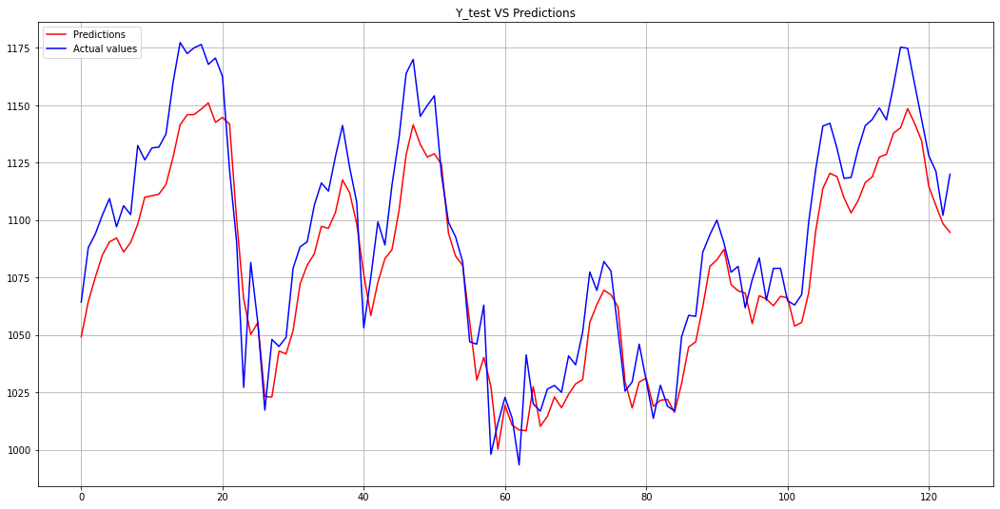

# Stock-Price-Prediction
Stock price prediction using 4 years of Google stock price data. 

Method 1: Univariate (single feature)  
Predicting next day's value of stock price by providing previous 5 day's values.I used 'Open' feature for univariate method.  
Result: 10 RMSE for test data.   
Plotting Actual(blue) and Predicted(red) values from test(unseen) data. 

Method 2: Multivariate(multiple feature)  
Predicting next day's 'Open' feature value of stock price by providing previous day's 4 main stock features i.e. ('Open', 'Close', 'High', 'Low')  
Result: 14 RMSE for test data.  
Plotting Actual(blue) and Predicted(red) values from test(unseen) data.  
  

Links:
Dataset: https://www.kaggle.com/ptheru/googledta
Colab Notebook for univariate: https://colab.research.google.com/drimulve/1nixrkHF_kbvFTW2CD4xTSluQm_fc8W42
Colab Notebook for multivariate: https://colab.research.google.com/drive/1lhk14GKlm9JJWR4DOvBqj1KnZDLjkyiy
